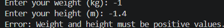
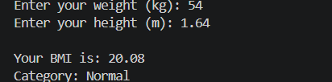

# BMI Calculator

A simple command-line BMI (Body Mass Index) calculator developed using Python. The program accepts the user's weight and height, calculates their BMI, and classifies the result into standard BMI categories.

This project was developed as part of the **OIBSIP Python Programming Internship**.

---

## Features

* Accepts weight in kilograms (kg)
* Accepts height in meters (m)
* Calculates BMI using the standard BMI formula
* Classifies BMI into four categories:

  * Underweight
  * Normal
  * Overweight
  * Obese
* Displays BMI rounded to 2 decimal places
* Handles non-numeric input
* Rejects zero and negative values
* Provides helpful error messages for invalid input

---

## BMI Formula

The BMI is calculated using:

```text
BMI = Weight / Height²
```

Where:

* Weight is measured in kilograms (kg)
* Height is measured in meters (m)

### Example

For a person weighing 54 kg with a height of 1.64 m:

```text
BMI = 54 / (1.64²)
    = 20.08
```

The BMI falls under the **Normal** category.

---

## BMI Categories

| BMI Range    | Category    |
| ------------ | ----------- |
| Below 18.5   | Underweight |
| 18.5 – 24.9  | Normal      |
| 25 – 29.9    | Overweight  |
| 30 and above | Obese       |

---

## Technologies Used

* Python
* `input()`
* Functions
* Conditional statements
* Exception handling
* Basic arithmetic operations

---

## Project Structure

```text
Python-Task2-BMICalculator/
│
├── bmi_calculator.py
├── README.md
└── .gitignore
```

> The `.venv` virtual environment is used locally for development and is excluded from Git using `.gitignore`.

---

## How to Run

### 1. Clone the Repository

```bash
git clone https://github.com/Sidharthrahul04/OIBSIP.git
```

### 2. Navigate to the Project

```bash
cd OIBSIP/Python-Task2-BMICalculator
```

### 3. Create a Virtual Environment

```bash
python -m venv .venv
```

### 4. Activate the Virtual Environment

#### Windows PowerShell

```powershell
.\.venv\Scripts\Activate.ps1
```

#### Windows Command Prompt

```cmd
.venv\Scripts\activate
```

### 5. Run the Program

```bash
python bmi_calculator.py
```

---

## Sample Output

### Normal BMI

```text
Enter your weight (kg): 54
Enter your height (m): 1.64

Your BMI is: 20.08
Category: Normal
```

### Invalid Input

```text
Enter your weight (kg): abc

Error: Please enter numeric values for weight and height.
```

### Negative Input

```text
Enter your weight (kg): -54
Enter your height (m): 1.64

Error: Weight and height must be positive values.
```
# BMI Calculator

A simple command-line BMI (Body Mass Index) calculator developed using Python. The program accepts the user's weight and height, calculates their BMI, and classifies the result into standard BMI categories.

This project was developed as part of the **OIBSIP Python Programming Internship**.

---

## Features

- Accepts weight in kilograms (kg)
- Accepts height in meters (m)
- Calculates BMI using the standard BMI formula
- Classifies BMI into four categories:
  - Underweight
  - Normal
  - Overweight
  - Obese
- Displays BMI rounded to 2 decimal places
- Handles non-numeric input
- Rejects zero and negative values
- Provides helpful error messages for invalid input

---

## BMI Formula

The BMI is calculated using:

```text
BMI = Weight / Height²
```

Where:

- Weight is measured in kilograms (kg)
- Height is measured in meters (m)

### Example

For a person weighing 54 kg with a height of 1.64 m:

```text
BMI = 54 / (1.64²)
    = 20.08
```

The BMI falls under the **Normal** category.

---

## BMI Categories

| BMI Range | Category |
|-----------|----------|
| Below 18.5 | Underweight |
| 18.5 – 24.9 | Normal |
| 25 – 29.9 | Overweight |
| 30 and above | Obese |

---

## Technologies Used

- Python
- `input()`
- Functions
- Conditional statements
- Exception handling
- Basic arithmetic operations

---

## Project Structure

```text
Python-Task2-BMICalculator/
│
├── screenshots/
│   ├── bmi-normal.png
│   └── bmi-invalid.png
│
├── bmi_calculator.py
├── readme.md
└── .gitignore
```

> The `.venv` virtual environment is used locally for development and is excluded from Git using `.gitignore`.

---

## How to Run

### 1. Clone the Repository

```bash
git clone https://github.com/Sidharthrahul04/OIBSIP.git
```

### 2. Navigate to the Project

```bash
cd OIBSIP/Python-Task2-BMICalculator
```

### 3. Create a Virtual Environment

```bash
python -m venv .venv
```

### 4. Activate the Virtual Environment

#### Windows PowerShell

```powershell
.\.venv\Scripts\Activate.ps1
```

#### Windows Command Prompt

```cmd
.venv\Scripts\activate
```

### 5. Run the Program

```bash
python bmi_calculator.py
```

---

## Sample Output 

### Normal BMI

```text
Enter your weight (kg): 54
Enter your height (m): 1.64

Your BMI is: 20.08
Category: Normal
```

### Invalid Input

```text
Enter your weight (kg): abc

Error: Please enter numeric values for weight and height.
```

### Negative Input

```text
Enter your weight (kg): -54
Enter your height (m): 1.64

Error: Weight and height must be positive values.
```


## Input Validation

The program validates user input before performing the BMI calculation.

It handles:

- Non-numeric values
- Zero values
- Negative values

This prevents invalid values from being used in the BMI calculation and provides helpful error messages to the user.

---

## Learning Outcomes

Through this project, the following Python concepts were practiced:

- Taking input from the user
- Type conversion using `float()`
- Arithmetic operations
- Functions
- Conditional statements
- Exception handling using `try` and `except`
- Input validation
- Formatted output
- Working with Git and GitHub

---

## Internship Task

**Internship:** OIBSIP Python Programming Internship

**Task:** Task 2 – BMI Calculator

**Project Type:** Command-Line Application
---

## Screenshots

### BMI Calculator – Normal Result

Add a screenshot of the program showing a invalid BMI calculation input.



### BMI Calculator – Invalid Input

Add a screenshot showing the BMI Calculation output.



---

## Input Validation

The program validates user input before performing the BMI calculation.

It handles:

* Non-numeric values
* Zero values
* Negative values

This prevents invalid values from being used in the BMI calculation and provides helpful error messages to the user.

---

## Learning Outcomes

Through this project, the following Python concepts were practiced:

* Taking input from the user
* Type conversion using `float()`
* Arithmetic operations
* Functions
* Conditional statements
* Exception handling using `try` and `except`
* Input validation
* Formatted output
* Working with Git and GitHub

---

## Internship Task

**Internship:** OIBSIP Python Programming Internship

**Task:** Task 2 – BMI Calculator

**Project Type:** Command-Line Application

---

