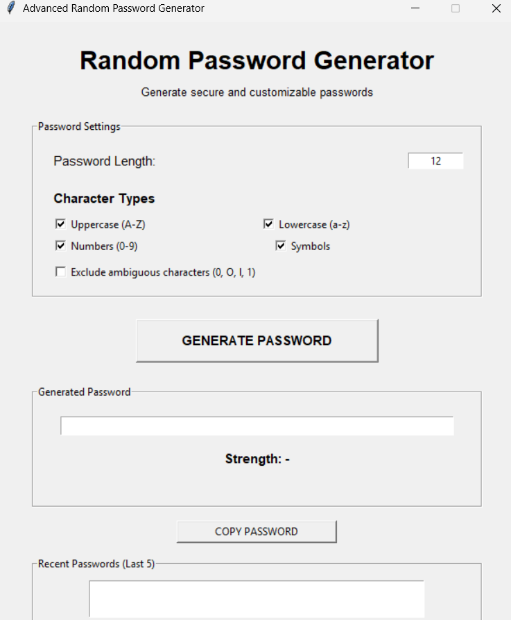
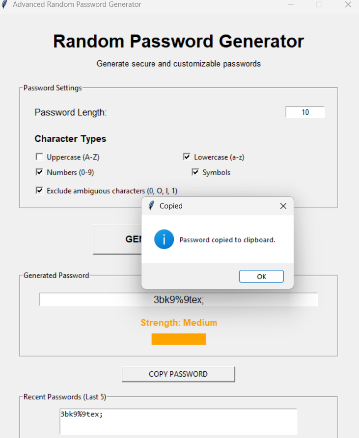
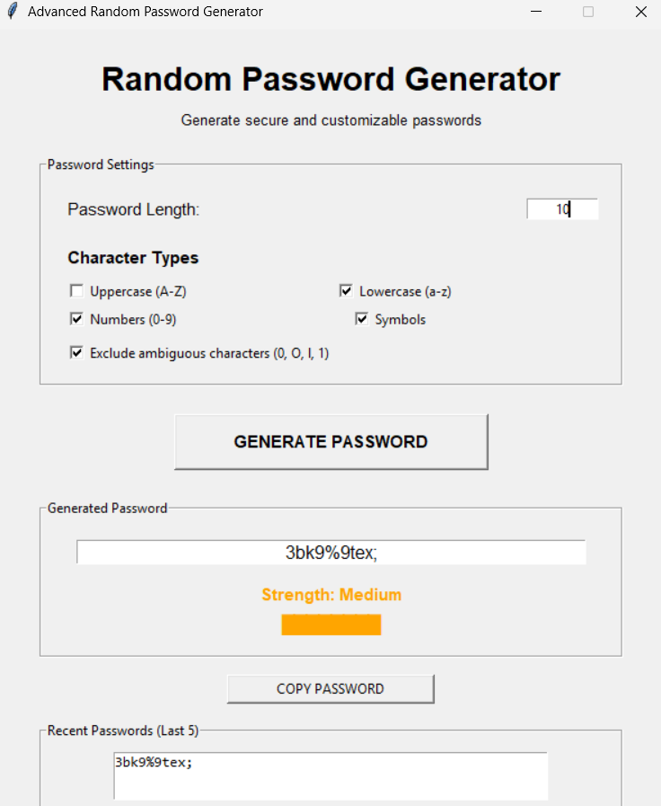
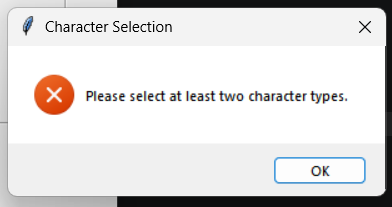

# 🔐 Random Password Generator

A Python-based desktop application that generates secure and customizable passwords based on user-selected requirements.

The application provides a graphical user interface where users can choose the password length, character types, and whether ambiguous characters should be excluded. It also evaluates password strength, allows passwords to be copied to the clipboard, and maintains a session history of the last five generated passwords.

---

## 📌 Features

- Generate random passwords using Python's `secrets` module
- Select password length
- Include or exclude uppercase letters
- Include or exclude lowercase letters
- Include or exclude numbers
- Include or exclude symbols
- Exclude ambiguous characters such as `0`, `O`, `l`, and `1`
- Guarantee at least one character from each selected character type
- Password strength evaluation
- Copy generated passwords to the system clipboard
- Maintain the last five generated passwords during the current session
- Input validation and error handling
- Desktop graphical user interface using Tkinter

---

## 🛠️ Tech Stack

| Technology | Purpose |
|------------|---------|
| Python | Application programming language |
| Tkinter | Graphical user interface |
| secrets | Secure random password generation |
| string | Standard character sets |
| Pyperclip | Clipboard functionality |

---

## 🏗️ Project Architecture

The project follows a simple modular structure by separating the graphical interface from the password-generation logic.

```text
                    ┌─────────────────────┐
                    │       User          │
                    └──────────┬──────────┘
                               │
                               ▼
                    ┌─────────────────────┐
                    │      main.py        │
                    │    GUI / Tkinter    │
                    └──────────┬──────────┘
                               │
                    Calls password logic
                               │
                               ▼
                    ┌─────────────────────┐
                    │    generator.py     │
                    │                     │
                    │ • Character Sets    │
                    │ • Password Generator│
                    │ • Strength Checker  │
                    └──────────┬──────────┘
                               │
                               ▼
                    ┌─────────────────────┐
                    │ Generated Password  │
                    └──────────┬──────────┘
                               │
                    ┌──────────┴──────────┐
                    ▼                     ▼
              GUI Display            Clipboard
                                      (Pyperclip)

🔄 Application Workflow
Start Application
       ↓
Open Tkinter GUI
       ↓
Enter Password Length
       ↓
Select Character Types
       ↓
Choose Ambiguous Character Option
       ↓
Click Generate Password
       ↓
Validate User Input
       ↓
Build Character Sets
       ↓
Generate Password Using secrets
       ↓
Calculate Password Strength
       ↓
Display Password and Strength
       ↓
Store Password in Session History
       ↓
User Can Copy Password

📁 Project Structure
Python-Task3-RandomPasswordGenerator/
│
├── .venv/
│   └── Virtual environment
│
├── main.py
│   └── Tkinter GUI and application logic
│
├── generator.py
│   └── Password generation and strength evaluation
│
├── requirements.txt
│   └── External Python dependency
│
├── .gitignore
│   └── Files and folders excluded from Git
│
└── README.md
    └── Project documentation

🔐 Password Generation

The application uses Python's built-in secrets module for password generation.

Instead of using the regular random module, the application uses:

secrets.choice()

for selecting characters.

The generated password is also securely shuffled using:

secrets.SystemRandom().shuffle()

This makes the password generation suitable for security-sensitive password creation.

🎯 Character Selection

Users can customize the password by selecting:

Uppercase letters: A-Z
Lowercase letters: a-z
Numbers: 0-9
Symbols

The application also ensures that at least one character from each selected category is included in the generated password.

For example, if the user selects:

Uppercase
Lowercase
Numbers
Symbols

the generated password will contain at least one character from each category.

👁️ Ambiguous Character Exclusion

The application provides an option to exclude visually confusing characters:

0
O
l
1

This can make passwords easier to read and manually enter.

💪 Password Strength

The application evaluates the generated password based on factors such as:

Password length
Presence of uppercase letters
Presence of lowercase letters
Presence of numbers
Presence of symbols

The result is displayed as:

Weak
Medium
Strong
📋 Clipboard Support

The Copy Password button uses the Pyperclip library to copy the currently generated password to the system clipboard.

This allows the user to paste the password directly into another application.

🕘 Password History

The application maintains a session-based history of the last five generated passwords.

Whenever a new password is generated:

New Password
     ↓
Add to History
     ↓
Keep Maximum 5
     ↓
Remove Oldest if Necessary

The history is stored only while the application is running and is not saved permanently to disk.

✅ Input Validation

The application validates user input before generating a password.

Examples include:

Invalid or non-numeric password length
Password length below the minimum
Too few character categories selected
Password length shorter than the number of selected character categories

Error messages are displayed through Tkinter message boxes.

📦 Requirements
Python 3.10 or newer
Tkinter
Pyperclip
⚙️ Installation
1. Clone the repository
git clone <your-github-repository-url>
2. Open the project directory
cd Python-Task3-RandomPasswordGenerator
3. Create a virtual environment
python -m venv .venv
4. Activate the virtual environment
Windows PowerShell
.venv\Scripts\Activate.ps1
Windows Command Prompt
.venv\Scripts\activate
5. Install dependencies
python -m pip install -r requirements.txt
▶️ Running the Application

After activating the virtual environment:

python main.py

The Random Password Generator GUI will open.

🖥️ How to Use
Enter the required password length.
Select the character types you want.
Enable ambiguous-character exclusion if required.
Click Generate Password.
Review the generated password.
Check the displayed password strength.
Click Copy Password if you want to copy it.
View previously generated passwords in the session history.
🔒 Security Considerations

The application uses Python's secrets module rather than the standard random module for password generation.

Passwords are generated in memory and the application does not store them permanently in a file or database.

The password history is maintained only for the current application session.

🚀 Future Improvements

Possible future enhancements include:

Password visibility toggle
Custom password patterns
Password strength meter with more detailed scoring
Securely clearing clipboard contents after a configurable period
Option to clear password history
Dark mode
Password generation presets
Export or password-manager integration

---

## 📸 Screenshots

### Main Interface



### Password creaation 



##copy to clipboard



### Input Validation



---